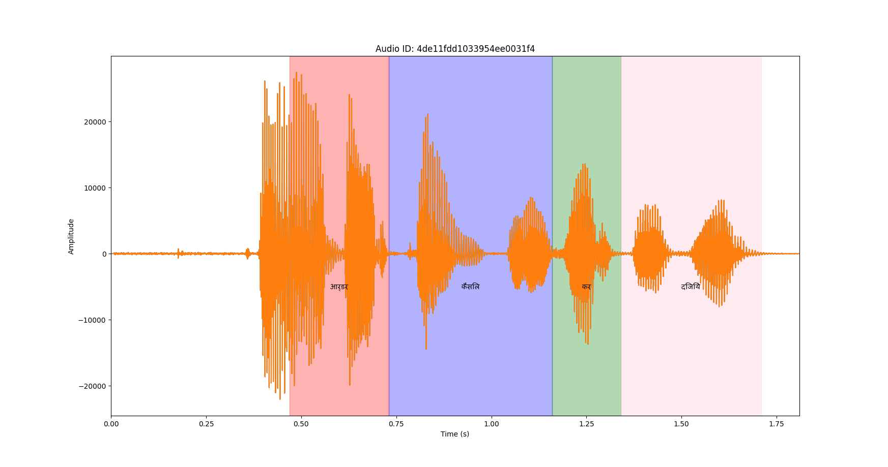
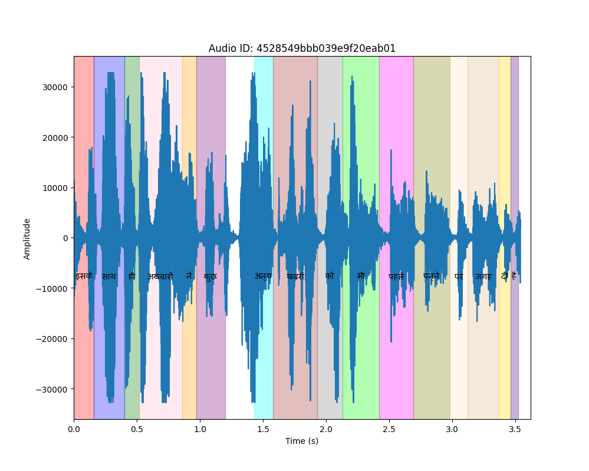

# Audio Waveform and Word Alignments Visualization

## Task Description

This project involves generating waveforms of audio files along with word alignments based on information from a CTM (Continuous Time Marked) file. The script reads the CTM file and associated audio files, and then plots the waveforms with marked word intervals.

### Task Details

- Read the supplied CTM file and audio files.
- Generate waveforms for each audio file.
- Display word alignments on the waveform plots.
- Annotate words on the waveform plot.

Sample output file [plot_64de11fdd1033954ee0031f4.png](plot_64de11fdd1033954ee0031f4.png) is provided for reference.

All reference data is available in [Google Drive Folder](https://drive.google.com/drive/u/0/folders/1DP7GYT1k3ZiNC2wauGetaRskqXm2TH4Y).

### Deliverables

A fully functional script (`Pinnacle_ASR_Task_Script.py`) for generating waveforms along with waveform output images.

## Implementation

The script `Pinnacle_ASR_Task_Script.py` processes the CTM file and audio files to create visualizations. It utilizes Matplotlib for plotting waveforms, highlighting word intervals, and annotating words on the plot.

## Usage

1. Download the script `Pinnacle_ASR_Task_Script.py`.

2. Install the required libraries if not already installed:
   ```sh
   pip install matplotlib numpy scipy

## Outputs
1. The Waveform and the corresponding words for the Audio 1 are marked in the plot as, 
2. The Waveform and the corresponding words for the Audio 1 are marked in the plot as, 